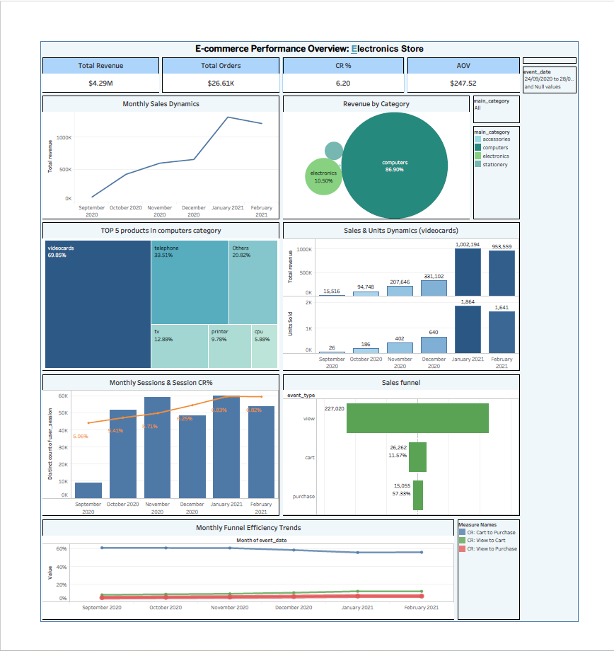

# TechMarket Analysis

> Exploratory data analysis of an electronics e-commerce store — team educational project.
> Contributed as **Data Analyst** (Python, Tableau Public).

---

## Project Description

Exploratory analysis of an electronics e-commerce store based on the public dataset
["eCommerce Events History in Electronics Store"](https://www.kaggle.com/datasets/mkechinov/ecommerce-events-history-in-electronics-store)
from Kaggle. Since real internal website data is not publicly available, this project uses
open-source data to simulate a real-world analytics workflow for an online electronics retailer.

---

## Tools

- **Python** (Jupyter Notebook / Google Colab) — data cleaning, feature engineering, EDA
- **Tableau Public** — interactive dashboard
- **Google Docs** — project documentation

---

## Analysis Notebook

The full analysis is available in Google Colab:
[Open notebook →](https://colab.research.google.com/drive/1BTi7UGrVfjwN44JzY3Lo1E3uetEV7XIK#scrollTo=Vic6TTIpwJXy)

### Notebook structure

1. Data Loading — importing and overview of the dataset
2. Data Inspection — checking data types, shape, and basic statistics
3. Data Cleaning — handling missing values, duplicates, and outliers
4. Feature Engineering — transforming data for analysis
5. Exploratory Data Analysis (EDA)
   - 5.1 Sales Performance Analysis
   - 5.2 Acquisition and Retention Success
   - 5.3 Purchase Funnel Optimization
   - 5.4 Product Assortment Analysis

---

## Key Findings

- **Critical single-product dependency**: video cards grew from 20% to 78.5% of total revenue over 6 months, with signs of scarcity-driven demand — ARPPU spiked to 379, Retention Rate dropped from 9.62% to 6.42%, and Time-to-Purchase approached 0
- **Electronics**: highest traffic (103,702 sessions) but conversion rate of 4.51% is below average (6.2%); revenue declining since November 2020
- **Sales funnel improved** overall (Funnel CR: 5.08% → 6.87%), yet cart → purchase conversion is gradually falling (61.4% → 56.3%), indicating growing cart abandonment
- **Stationery**: 94.5% of category revenue comes from a single product (ink cartridge); conversion rate of 6.45% above average — stable demand with expansion potential
- **Accessories** is virtually non-existent: 0.05% of total revenue, one product sold (bag, 56 units over the entire period)

---

## Links

- [Live Demo](https://techmarket-shop.onrender.com/) — deployed store
- [Tableau Dashboard](https://public.tableau.com/app/profile/iryna.savelieva/viz/Elstore/Dashboard1) — interactive visualization
- [DB Schema](https://app.eraser.io/workspace/0nMUqCax4cXy8Dg6Wglb) — entity-relationship diagram
- [Analysis Notebook](https://colab.research.google.com/drive/1BTi7UGrVfjwN44JzY3Lo1E3uetEV7XIK#scrollTo=Vic6TTIpwJXy) — Google Colab
